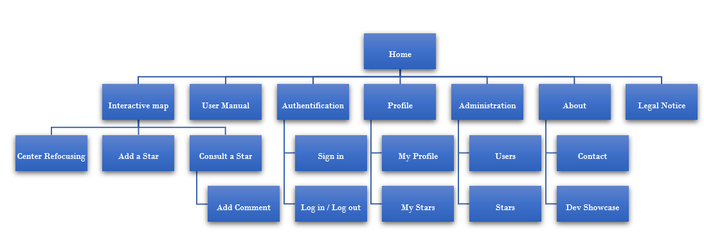

# Functionnal Specifications

## Project's Presentation

The project involves a ludic website, which allow astronomy fans and rookies to contribute to the body of knowledge in this domain, using a custom fictive representation of space and stars in the form of an interactive map.

## Goals

Provide a collaborative web app for the astronomy fans community, as well as newbies.

## Delay

4 weeks.

## MVP

### Back

- API : database, security, routes, administration and CRUD (Create, Read, Update, Delete)
- Admin Interface : administration and moderation of datas and users
- Forbidden words dictionnary
- (Grading system: depending on the level of the user input (number of stars created, reactions / comments left, ...)

### Front

- Interactive map : setting up a canvas (space navigation, consultation and creation of stars, comments, likes / ratings, refocusing)
- Navbar : access to user interactions (authentication, profile) and to the site links (home page, page of instructions for using card interactions, about, contact)

- User's profile : summarize and edit the registration informations (nickname, email, password), complete additional informations (avatar, first name, birth date, bio, ...) and consult user contributions (stars, comments, likes)
- Ambiant sound theme system (disabled by default)

## Functional specifications

### Appearence

Dynamic starry night sky (background), with SVG stars superimposed on it.
Responsive design, sound immersion.

### Contents

- stars
- stars types (planets, stars, satellites, ...)
- contributors
- pages
- back office

### Languages

English.

### Tree view

- Home
- Interactive map
  - Refocusing on the center of the map
  - Add a star
  - Consult a star
  - Add comment
- User manual
- Sign in
- Log in
  - (Profile)
    - Profile
    - My stars
  - (Administration)
    - Users
    - Stars
  - (Log out)
- About
- Legal Notice

### Navigation

- Home page : buttons
- Interactive map : collapse lateral menu
- Other pages : fixed menu
- Responsive : burger menu

### Templates

#### Global layout

- Title/logotype.
- Semi-transparent background picture
- Buttons linked to :
  - Log in form
  - User manual
  - Interactive map
- Footer :
  - Legal notice
  - About page (Contact + social network)

#### Interactive map

- Collapse menu
- Map

#### Profile

Profile :

- Fixed menu / profile submenu with tabs to access to other options
- Profile with user informations + edit to open input
  - Submit button

Preferences :

- Fixed menu / profile submenu with tabs to access to other options
- User controls (toggle notifications, theme...)

My stars :

- Fixed menu / profile submenu with tabs to access to other options
- My created stars list

#### About

- Fixed menu
- Team presentation cards
  - Risitas picture
  - Name / Nickname
  - Role
  - Social networks links

#### User Manual

- Fixed menu
- Fixed map screenshot with hotpoints to explain how to use the map on hover (tips) OR
- Video animation ? OR
- Text only with screenshots

#### Legal notice

- Fixed menu
- RGPD

### Technical constraints

Responsive design
Compatibility with the latest versions of browsers (Chrome, Firefox and Edge).

### Team scrum roles

| **Alex** | **Shirin** | **Arnaud** | **William**  
|:---:|:---:|:---:|:---:|
| Scrum Master | Git Master Front | Git Master Back | Product Owner |
| Developer Front | Lead Dev Front | Developer Back | Lead Dev Back |

### Technical Specifications

#### Software architecture

The application will be designed via:

##### Front end

- CSS 3 - integration
- React 16.2 - App administration.
- react-particles : dynamic background generation
- react-sound : soundscape
- p5.js/p5-react : design the map's canva
  
##### Back end

- MySQL : stock datas.
- PhpMyAdmin : database manager
- PHP : PHP 7.2 will be used.
- Symfony : 5.0 version or more, to set up the restful API.

### Targets

Fans and lovers of astronomy, all ages.

### Future developments : V2 | V3

#### About interactive map

----------------

    - zoom on the map
    - search bar to search one star
    - filter and sort stars (search results will make irrelevant stars transparent)
    - Add a global chatroom for connected users
    - Create constellations of multiple stars
    - Create different maps (= galaxies).
    - Add stars to favorites.
    - Vote for stars.

#### About users

----------------

    - Gamification: win a grade / an achievement 
    - Add a "preference" tag in the profile menu, to manage notifications.
    - Add a notation system
    - Send a validation mail to new users
    - When user connects to his account, he's redirected to the last star visited
    - receive a notification when a new comment / vote is added on a user's star. 
    - Contributor of the Month

#### About stars creation

----------------

    - Create constellations while linking stars together
    - Create a GUI for stars and planets custom design

#### About admin back office

----------------

    - Add moderation options (stats, visits)

#### About additional functions

----------------

    - Add a blog about space, new Rajouter un blog en rapport à l'espace, new discoveries, recommended material, etc ...
    - Create a community forum on various topics about astronomy
    - Add i18n library to add internalisation (French, other languages).

### Users Stories

| Trello | JSON |
|:---:|:---:|
| [Available on Trello](https://trello.com/b/TPK9IEjv/user-stories)  | [Format JSON](https://trello.com/b/TPK9IEjv.json)  |
| | |

#### Home

| As | I want | To (if needed) | Efforts |
|--|--|--|--|
| visitor | access to the home page | to access the read only map, log in / sign in option, and the other pages of the app | 3 |
| visitor | access to the app pages | to consult about page, the chart and legal notice | 2 |
| visitor | skip intro and choose not to see it anymore | to display home page directly without playing intro | 8 |
| visitor | see and contact dev team | to say hello and have more infos about the dev team | 3 |

#### Map

| As | I want | To (if needed) | Efforts |
|--|--|--|--|
| visitor | access to the card in read only mode | to consult stars and explore the map | 21 |
| visitor | move on the card in read only mode | to consult stars and explore the map | 13 |
| visitor | consult a star | to see its informations and coordinates | 5 |
| visitor | refocus the map on the sun | to find your way | 3 |
| connected user | access to the full map | to access full functionalities | 13 |
| connected user | add a new star | to create my own stars | 8 |
| connected user | edit one of my stars | to change infos of my stars | 8 |
| connected user | delete one of my stars | to delete my own stars | 5 |
| connected user | comment a star | leave a comment on someone's star | 5 |
| connected user | access to someone's complete profile | see other users informations | 5 |
| connected user | vote for a star | - | 3 |
| visitor | turn on/off the soundscape | improve UX | 3 |
| visitor | access to the minimal profile (light version) of the other users | see others informations | 3 |

#### Auth

| As | I want | To (if needed) | Efforts |
|--|--|--|--|
| visitor | access to log in and/or sign in | to access to the whole fonctionnalities of the map | 8 |
| visitor | be able to log out | close my session | 1 |
| visitor | receive an email confirming my registration | to reminder me of my identifiers | 3 |

#### Profile page

| As | I want | To (if needed) | Efforts |
|--|--|--|--|
| visitor | access to my stars list | to consult my own stars and edit it | 3 |
| visitor | access to my profile and edit it | to manage my informations and avatar | 5 |

#### Admin

| As | I want | To (if needed) | Efforts |
|--|--|--|--|
| admin | access to all the functionnality of the other roles | - | 3 |
| admin | access to the back office with all the functionnalities | to consult the list of all users and all stars | 8 |
| admin | consult a full list of the users | to consult, moderate or ban users | 2 |
| admin | add and edit forbidden words in the dictionnary | to manage forbidden words | ? |
| admin | prohibit forbidden words in the forms | to prevent users from using forbidden words in the forms | 5 |
| admin | definitely ban a user | moderate users | 3 |

### Routes

#### Back

| URL | HTTP Method | Controller | Method | Name | Response | Comment
|:---:|:---:|:---:|:---:|:---:|:---:|:---:|
| /login | GET / POST | SecurityController | login | api_login | 200 / 401 | connects a user |
| /logout | GET | SecurityController | logout | api_logout | 200 / 401 | disconnects a user |
| /celestial-bodies | GET | CelestialBodyController | getAll | api_celestial_bodies_list | 200 / 404 | retrieves all the celestial bodies |
| /celestial-bodies/{:slug} | GET | CelestialBodyController | getOne | api_celestial_body | 200 / 404 | retrieves a particular celestial body |
| /celestial-bodies | POST | CelestialBodyController | create | api_create_celestial_body | 201 / 401 | creates a new celestial body |
| /celestial-bodies/{:slug} | PATCH | CelestialBodyController | update | api_update_celestial_body | 200 / 401 | updates a user's celestial body |
| /celestial-bodies/{:slug} | DELETE | CelestialBodyController | delete | api_delete_celestial_body | 204 / 401 | deletes a user's celestial body |
| /properties | GET | PropertyController | getAll | api_properties_list | 200 / 404 | retrieves all the properties |
| /users | GET | UserController | getAll | api_users_list | 200 / 404 | retrieves all users |
| /users/{:slug} | GET | UserController | getOne | api_user | 200 / 404 | retrieves a particular user |
| /users | POST | UserController | create | api_create_user | 201 / 401 | creates a new user |
| /users/{:slug} | PATCH | UserController | update | api_update_user | 200 / 401 | updates a  user |
| /users/{:slug} | DELETE | UserController | delete | api_delete_user | 204 / 401 | deletes a user |
| /users/{:slug}/celestial-bodies | GET | UserController | getCelestialBodies | api_user_celestial_bodies | 200 / 404 | retrieves all user's celestialbodies |
| /comments | GET | CommentController | getAll | api_comments_list | 200 / 404 | retrieves all comments |
| /comments/{:id} | GET | CommentController | getOne | api_comment | 200 / 404 | retrieves a particular comment |
| /comments | POST | CommentController | create | api_create_comment | 201 / 401 | adds a comment on a celestial_body |
| /comments/{:id} | PATCH | CommentController | update | api_update_comment | 200 / 401 | updates a user's comment |
| /comments/{:id} | DELETE | CommentController | delete | api_delete_comment | 204 / 401 | deletes a user's comment |
| /admin/users | PATCH | AdminController | toggleUserStatus | api_toggle_user | 200 / 401 | bans or unbans a user |

#### Front

| URL | Required data | Comment 
|:---:|:---:|:---:|
| /home | None | Homepage with all the available links | 
| /login | api_login | login modal |  
| /signin | api_create_user | signin modal |   
| /space | api_celestial_bodies_list,  api_user, api_create_celestial_body, api_properties_list, api_celestial_body, api_update_celestial_body, api_delete_celestial_body | Our interactive map where all the celestial bodies are loaded + actions available (add, update, delete celestial bodies) |   
| /profile | api_update_user, api_user | Global informations about the user |  
| /profile/celestial-bodies | api_user, api_user_celestial_bodies  | List of all the celestial bodies the user created |  
| /admin | None | Admin panel |  
| /admin/users | api_users, api_delete_user, api_update_user | Panel to moderate users (update or delete an user) |  
| /admin/celestial-bodies | api_celestial_bodies_list, api_delete_celestial_body, api_update_celestial_body  | Panel to moderate celestial-bodies |  
| /about | None | Where the contact form and the dev presentation are |  
| /user-manual | None | The User's How To : Navigate on the map, add, update or delete a celestial_body, check a celestial_body... |  
| /legal-notice | None | Legal chart of the website |