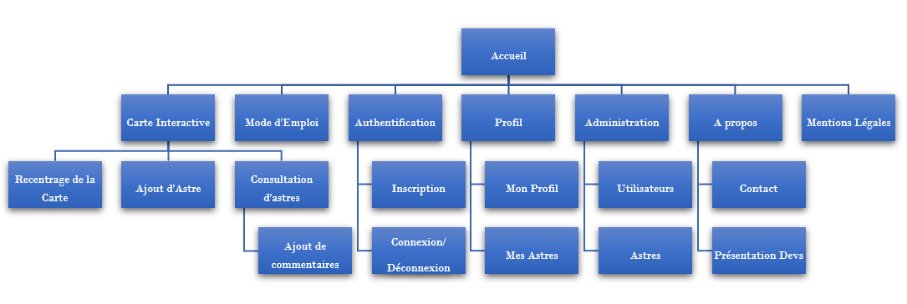

# Cahier des charges

## Présentation du projet

Le projet consiste en un site ludique qui permettrait aux fans d'astronomie comme aux néophytes de contribuer à la diffusion des connaissances de ce domaine et de les découvrir par le biais d'une représentation fictive, customisée de l'espace et de ses différents astres sous forme de carte interactive.

## Objectifs

Mettre à disposition une application web collaborative au service de la communauté des fans - comme des moins fans - d'astronomie.

## Délai

4 semaines.

## MVP

### Back :

- API : base de données, sécurité, routes, gestion et CRUD (ajout, affichage, édition et suppression)
- Interface d'administration : gestion et modération des données et des utilisateurs
- Dictionnaire des mots interdits
- (Système de grades : en fonction du degré de contribution des utilisateurs (nombre d'astres créés, de réactions / commentaires laissés, ...))

### Front :

- Carte interactive : mise en place d'un canevas (navigation dans l'espace, consultation et création d'astres, de commentaires, de likes / notations, recentrage)
- Barre de navigation : création d'accès aux interactions d'utilisateur (authentification, profil) et aux liens du site (page d'accueil, page du mode d'emploi des interactions de la carte, about, contact)
- Profil d'utilisateur : résumé et édition des informations d'inscription (pseudo, email, mot de passe), complétion d'informations annexes (avatar, prénom, date de naissance, bio, ...) et consultation des contributions de l'utilisateur (astres, commentaires, likes)
- Système de thème sonore d'ambiance (désactivé par défaut)

## Spécifications fonctionnelles

### Apparence

Ciel étoilé dynamique (background) avec les astres en PNG (superposition).
Site responsive. Immersion sonore.

### Contenus

- des astres
- des types d'astres (planètes, étoiles, satellites, ...)
- des contributeurs
- des pages
- un back office

### Langues

Anglais.

### Arborescence

- Accueil
- Carte interactive
  - Recentrage de la carte
  - Ajout d'astre
  - Consultation d'astres
  - Ajout de commentaires
- Mode d'emploi
- Inscription
- Connexion
  - (Profil)
    - Profil
    - Mes Astres
  - (Administration)
    - Utilisateurs
    - Astres
  - (Déconnexion)
- À propos
- Mentions légales

### Navigation

- Page d'accueil : boutons
- Carte interactive : collapse menu latéral
- Autres pages : menu fixe
- Responsive : burger menu

### Templates

#### Layout global

- Titre/logo.
- Une image principale semi-opaque en background
- Boutons avec liens vers :
  - Le formulaire de connexion
  - Le mode d'emploi
  - La carte interactive
- Un Footer avec :
  - Des mentions légales
  - À propos (Contact + réseaux sociaux)

#### Carte interactive

- Menu collapse
- Carte

#### Profil

Profil :
- Menu fixe avec un onglet Profil pour accéder aux autres options
- Profil avec les informations utilisateur + Modifier pour ouvrir l'input
  - Bouton submit

Préférences : 
- Menu fixe avec un onglet Profil pour accéder aux autres options
- Réglages 

Mes Astres : 
- Menu fixe avec un onglet Profil pour accéder aux autres options
- Liste des astres crées 

#### À propos

- Menu fixe
- Cartes de présentation de l'équipe 
  - Photo de Risitas
  - Nom Prénom/Pseudo
  - Rôle
  - Liens réseaux sociaux

#### Mode d'Emploi

- Menu fixe
- Image fixe de la carte interactive avec un effet d'hover pour expliquer les options OU
- Animation ? OU
- Paragraphes d'explications avec screens

#### Mentions Légales :

- Menu fixe
- Paragraphes RGPD

### Contraintes techniques

Site responsive.
Compatibilité dernières versions des navigateurs (Chrome, Firefox et Edge).

### Rôles de l'équipe 

| **Alex** | **Shirin** | **Arnaud** | **William**  |
|:---:|:---:|:---:|:---:|:---:|
| Scrum Master | Git Master Front | Git Master Back | Product Owner |
| Developer Front | Lead Dev Front | Developer Back | Lead Dev Back |
| | | | |

### Spécifications techniques

#### Architecture logicielle choisie

L'application sera conçue via :

**Côté front**

- CSS : nous utiliserons CSS dans sa version 3.
- React : Version 16.2 - Pour assurer la gestion de l'application.
- react-particles : Génération du fond (animation des particules)
- react-sound : Pour une ambiance sonore garantie!
- p5.js/p5-react : Pour designer le canevas.
  
**Côté back**

- MySQL : permettra de stocker nos données.
- PhpMyAdmin : Gestionnaire de bases de données.
- PHP : PHP 7.2 sera utilisé.
- Symfony : Version 5.0 ou plus pour la mise en place de l'API (REST).

### Cibles de l'application

Les fans comme les amateurs d'astronomie, tout âge confondu.

### Évolutions futures

*À propos de la carte interactive*  

    - voir la possibilité de zoomer sur la carte
    - Chercher un astre en particulier par une barre de recherche
    - Pouvoir filtrer et trier les astres (les résultats de la recherche rendent les astres non pertinents transparents)
    - Rajouter un chat général pour tous les utilisateurs connectés
    - Créer plusieurs cartes différentes (= galaxies).
    - Pouvoir mettre en favori des astres.
    - Pouvoir élire des astres.

*À propos des utilisateurs*  

    - Pouvoir gagner un grade / Des achievements 
    - Rajouter un onglet "Préférences" dans mon profil, principalement pour gérer les notifications.
    - Rajouter un système de notification
    - Lors de l'inscription, recevoir un mail de bienvenue
    - Lorsque l'utilisateur se reconnecte à la carte interactive, il est redirigé vers le dernier astre visité
    - Recevoir des notifications lorsqu'un commentaire/un vote est rajouté sur son profil ou quand un nouvel astre est crée. 
    - Mettre en avant le contributeur du mois

*À propos de la création d'astres*  

    - Pouvoir relier des étoiles pour créer des constellations
    - Créer un GUI pour la création de planètes

*À propos de l'espace administrateur*  

    - Rajouter des options à la modération (statistiques, visites...)

*À propos de fonctions annexes*  

    - Rajouter un blog en rapport à l'espace, de nouvelles découvertes, le matériel conseillé, etc...
    - Créer un forum communataire sur des topics divers de l'astronomie.
    - Pouvoir changer la traduction du site en français (EN/FR).

### Users Stories

| Trello | JSON |
|:---:|:---:|
| [Disponible sur Trello](https://trello.com/b/TPK9IEjv/user-stories)  | [Format JSON](https://trello.com/b/TPK9IEjv.json)  |
| | |

### Routes

#### Back

| URL | HTTP Method | Controller | Method | Name | Response | Comment
|:---:|:---:|:---:|:---:|:---:|:---:|:---:|
| /login | POST | SecurityController | login | api_login | 200 / 401 | connects a user |
| /logout | GET | SecurityController | logout | api_logout | 200 / 401 | disconnects a user |
| /stars | GET | StarController | getAll | api_stars_list | 200 / 404 | retrieves all the stars |
| /stars/{:name} | GET | StarController | getOne | api_star | 200 / 404 | retrieves a particular star |
| /stars | POST | StarController | create | api_create_star | 201 / 401 | creates a new star |
| /stars/{:name} | PATCH | StarController | update | api_update_star | 200 / 401 | updates a user's star |
| /stars/{:name} | DELETE | StarController | delete | api_delete_star | 204 / 401 | deletes a user's star |
| /users | GET | UserController | getAll | api_users_list | 200 / 404 | retrieves all users |
| /users/{:nickname} | GET | UserController | getOne | api_user | 200 / 404 | retrieves a particular user |
| /users | POST | UserController | create | api_create_user | 201 / 401 | creates a new user |
| /users/{:nickname} | PATCH | UserController | update | api_update_user | 200 / 401 | updates a  user |
| /users/{:nickname} | DELETE | UserController | delete | api_delete_user | 204 / 401 | deletes a user |
| /users/{:nickname}/stars | GET | UserController | getUserStars | api_user_stars | 200 / 404 | retrieves all user's stars |
| /comments | GET | CommentController | getAll | api_comments_list | 200 / 404 | retrieves all comments |
| /comments/{:id} | GET | CommentController | getOne | api_comment | 200 / 404 | retrieves a particular comment |
| /comments | POST | CommentController | create | api_create_comment | 201 / 401 | adds a comment on a star |
| /comments/{:id} | PATCH | CommentController | update | api_update_comment | 200 / 401 | updates a user's comment |
| /comments/{:id} | DELETE | CommentController | delete | api_delete_comment | 204 / 401 | deletes a user's comment |
| /admin/users | PATCH | AdminController | toggleUserStatus | api_toggle_user | 200 / 401 | bans or unbans a user |

#### Front

| URL | Required data | Comment 
|:---:|:---:|:---:|
| /home | None | Homepage with all the available links | 
| /login | api_login | login modal |  
| /signin | api_create_user | signin modal |   
| /space | api_stars_list,  api_user, api_create_star, api_star, api_update_star, api_delete_star | Our interactive map where all the stars are loaded + actions available (add, update, delete stars) |   
| /profile | api_update_user, api_user | Global informations about the user |  
| /profile/stars | api_user, api_user_stars  | List of all the stars the user created |  
| /admin | None | Admin panel |  
| /admin/users | api_users, api_delete_user, api_update_user | Panel to moderate users (update or delete an user) |  
| /admin/stars | api_stars_list, api_delete_star, api_update_star  | Panel to moderate stars |  
| /about | None | Where the contact form and the dev presentation are |  
| /user-manual | None | The User's How To : Navigate on the map, add, update or delete a star, check a star... |  
| /legal-notice | None | Legal chart of the website |