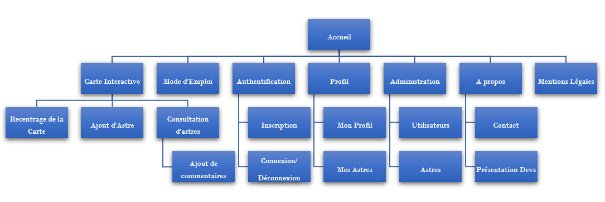

# Cahier des charges

## Présentation du projet

Le projet consiste en un site ludique qui permettrait aux fans d'astronomie comme aux néophytes de contribuer à la diffusion des connaissances de ce domaine et de les découvrir par le biais d'une représentation fictive, customisée de l'espace et de ses différents astres sous forme de carte interactive.

## Objectifs

Mettre à disposition une application web collaborative au service de la communauté des fans - comme des moins fans - d'astronomie.

## Délai

4 semaines.

## MVP

### Back

- API : base de données, sécurité, routes, gestion et CRUD (ajout, affichage, édition et suppression)
- Interface d'administration : gestion et modération des données et des utilisateurs
- Dictionnaire des mots interdits
- (Système de grades : en fonction du degré de contribution des utilisateurs (nombre d'astres créés, de réactions / commentaires laissés, ...))

### Front

- Carte interactive : mise en place d'un canevas (navigation dans l'espace, consultation et création d'astres, de commentaires, de likes / notations, recentrage)
- Barre de navigation : création d'accès aux interactions d'utilisateur (authentification, profil) et aux liens du site (page d'accueil, page du mode d'emploi des interactions de la carte, about, contact)
- Profil d'utilisateur : résumé et édition des informations d'inscription (pseudo, email, mot de passe), complétion d'informations annexes (avatar, prénom, date de naissance, bio, ...) et consultation des contributions de l'utilisateur (astres, commentaires, likes)
- Système de thème sonore d'ambiance (désactivé par défaut)

## Spécifications fonctionnelles

### Apparence

Ciel étoilé dynamique (background) avec les astres en PNG (superposition).
Site responsive. Immersion sonore.

### Contenus

- des astres
- des types d'astres (planètes, étoiles, satellites, ...)
- des contributeurs
- des pages
- un back office

### Langues

Anglais.

### Arborescence

- Accueil
- Carte interactive
  - Recentrage de la carte
  - Ajout d'astre
  - Consultation d'astres
  - Ajout de commentaires
- Mode d'emploi
- Inscription
- Connexion
  - (Profil)
    - Profil
    - Mes Astres
  - (Administration)
    - Utilisateurs
    - Astres
  - (Déconnexion)
- À propos
- Mentions légales

### Navigation

- Page d'accueil : boutons
- Carte interactive : collapse menu latéral
- Autres pages : menu fixe
- Responsive : burger menu

### Templates

#### Layout global

- Titre/logo.
- Une image principale semi-opaque en background
- Boutons avec liens vers :
  - Le formulaire de connexion
  - Le mode d'emploi
  - La carte interactive
- Un Footer avec :
  - Des mentions légales
  - À propos (Contact + réseaux sociaux)

#### Carte interactive

- Menu collapse
- Carte

#### Profil

Profil :

- Menu fixe avec un onglet Profil pour accéder aux autres options
- Profil avec les informations utilisateur + Modifier pour ouvrir l'input
  - Bouton submit

Préférences :

- Menu fixe avec un onglet Profil pour accéder aux autres options
- Réglages

Mes Astres :

- Menu fixe avec un onglet Profil pour accéder aux autres options
- Liste des astres crées

#### À propos

- Menu fixe
- Cartes de présentation de l'équipe
  - Photo de Risitas
  - Nom Prénom/Pseudo
  - Rôle
  - Liens réseaux sociaux

#### Mode d'Emploi

- Menu fixe
- Image fixe de la carte interactive avec un effet d'hover pour expliquer les options OU
- Animation ? OU
- Paragraphes d'explications avec screens

#### Mentions Légales

- Menu fixe
- Paragraphes RGPD

### Contraintes techniques

Site responsive.
Compatibilité dernières versions des navigateurs (Chrome, Firefox et Edge).

### Rôles de l'équipe

| **Alex** | **Shirin** | **Arnaud** | **William**  
|:---:|:---:|:---:|:---:|
| Scrum Master | Git Master Front | Git Master Back | Product Owner |
| Developer Front | Lead Dev Front | Developer Back | Lead Dev Back |

### Spécifications techniques

#### Architecture logicielle choisie

L'application sera conçue via :

##### Côté front

----------------

- CSS : nous utiliserons CSS dans sa version 3.
- React : Version 16.2 - Pour assurer la gestion de l'application.
- react-particles : Génération du fond (animation des particules)
- react-sound : Pour une ambiance sonore garantie!
- p5.js/p5-react : Pour designer le canevas.
  
##### Côté back

----------------

- MySQL : permettra de stocker nos données.
- PhpMyAdmin : Gestionnaire de bases de données.
- PHP : PHP 7.2 sera utilisé.
- Symfony : Version 5.0 ou plus pour la mise en place de l'API (REST).

### Cibles de l'application

Les fans comme les amateurs d'astronomie, tout âge confondu.

### Évolutions futures : V2 | V3

#### À propos de la carte interactive

----------------

    - voir la possibilité de zoomer sur la carte
    - Chercher un astre en particulier par une barre de recherche
    - Pouvoir filtrer et trier les astres (les résultats de la recherche rendent les astres non pertinents transparents)
    - Rajouter un chat général pour tous les utilisateurs connectés
    - Créer plusieurs cartes différentes (= galaxies).
    - Pouvoir mettre en favori des astres.
    - Pouvoir élire des astres.

#### À propos des utilisateurs

----------------

    - Pouvoir gagner un grade / Des achievements 
    - Rajouter un onglet "Préférences" dans mon profil, principalement pour gérer les notifications.
    - Rajouter un système de notification
    - Lors de l'inscription, recevoir un mail de bienvenue
    - Lorsque l'utilisateur se reconnecte à la carte interactive, il est redirigé vers le dernier astre visité
    - Recevoir des notifications lorsqu'un commentaire/un vote est rajouté sur son profil ou quand un nouvel astre est crée. 
    - Mettre en avant le contributeur du mois

#### À propos de la création d'astres

----------------

    - Pouvoir relier des étoiles pour créer des constellations
    - Créer un GUI pour la création de planètes

#### À propos de l'espace administrateur

----------------

    - Rajouter des options à la modération (statistiques, visites...)

#### À propos de fonctions annexes

----------------

    - Rajouter un blog en rapport à l'espace, de nouvelles découvertes, le matériel conseillé, etc...
    - Créer un forum communataire sur des topics divers de l'astronomie.
    - Pouvoir changer la traduction du site en français (EN/FR).

### Users Stories

| Trello | JSON |
|:---:|:---:|
| [Disponible sur Trello](https://trello.com/b/TPK9IEjv/user-stories)  | [Format JSON](https://trello.com/b/TPK9IEjv.json)  |
| | |

#### Page d'accueil

| En tant que | Je veux | Afin de (si besoin/nécessaire) | Effort |
|--|--|--|--|
| Visiteur | Je veux accéder à la page d'accueil | - | 3 |
| Visiteur | Je veux accéder aux autres pages du site (mode d'emploi, about...) | - | 2 |
| Visiteur | En tant que visiteur, je veux pouvoir passer l'intro et choisir de ne plus la voir. | Améliorer l'UX | 8 |
| Visiteur | En tant que visiteur, je veux pouvoir contacter l'équipe de devs | Donner son avis/Pouvoir résoudre des bugs | 3 |

#### Authentification

| En tant que | Je veux | Afin de (si besoin/nécessaire) | Effort |
|--|--|--|--|
| Visiteur | Je veux pouvoir me connecter, m'authentifier ou m'inscrire | Contribuer à la carte interactive / Voir mon profil | 8 |
| Utilisateur connecté | En tant qu'utilisateur connecté, je veux pouvoir me déconnecter| - | 1 |
| Visiteur | En tant que visiteur, je veux recevoir un mail de confirmation de mon inscription avec un rappel des identifiants | Confirmer mon inscription | 3 |

#### Carte

| En tant que | Je veux | Afin de (si besoin/nécessaire) | Effort |
|--|--|--|--|
| Visiteur | Je veux pouvoir me déplacer sur la carte | Parcourir l'univers | 13 |
| Visiteur | Je veux accéder à la carte en lecture seule | Voir les fonctionnalités de l'application | 21 |
| Visiteur | Je veux pouvoir consulter un astre | Voir sa description | 5 |
| Visiteur | Je veux pouvoir recentrer la carte sur le soleil (position 0,0) | Se déplacer plus facilement sur la carte | 3 |
| Visiteur | En tant que visiteur, je veux pouvoir choisir d'activer ou couper la musique d'ambiance | Personnaliser les préférences de l'utilisateur | 3 |
| Visiteur | En tant que visiteur, je veux pouvoir accéder au profil light des autres membres | Voir un aperçu du contenu du site | 3 |
| Utilisateur connecté | Je veux accéder à la carte avec toutes ses fonctionnalités| Pouvoir interagir | 13 |
| Utilisateur connecté | Je veux pouvoir ajouter un astre | - | 8 |
| Utilisateur connecté | Je veux pouvoir éditer un astre | - | 8 |
| Utilisateur connecté | Je veux pouvoir supprimer un de mes astres (et non ceux des autres) | - | 5 |
| Utilisateur connecté | En tant qu'utilisateur connecté, je veux pouvoir commenter un astre | Montrer ma participation au sein de la communauté | 5 |
| Utilisateur connecté | En tant qu'utilisateur connecté, je veux pouvoir accéder au profil complet des autres membres | Comparer mon profil à celui des autres | 5 |
| Utilisateur connecté | En tant qu'utilisateur connecté, je veux pouvoir noter un astre (compteur de likes) | - | 3 |

#### Page Profil

| En tant que | Je veux | Afin de (si besoin/nécessaire) | Effort |
|--|--|--|--|
| Utilisateur connecté | En tant qu'utilisateur connecté, je veux accéder à la liste de mes astres. | Retrouver les astres que j'ai crée dans la carte | 3 |
| Utilisateur connecté | En tant qu'utilisateur connecté, je veux accéder à mon profil et pouvoir le modifier. | Mettre à jour mes informations | 5 |

#### Page et Rôle Admin

| En tant que | Je veux | Afin de (si besoin/nécessaire) | Effort |
|--|--|--|--|
| Admin | En tant qu'admin, je veux pouvoir accéder à toutes les fonctionnalités des autres rôles. | - | 3 |
| Admin | En tant qu'admin, je veux pouvoir accéder au back-office avec toutes les fonctionnalités | - | 8 |
| Admin | En tant qu'admin, je veux pouvoir accéder à la liste de tous les utilisateurs | Modérer les utilisateurs | 2 |
| Admin | En tant qu'admin, je veux pouvoir ajouter ou éditer des mots dans le dictionnaire des mots interdits | Modérer le contenu inapproprié | ? |
| Admin | En tant qu'admin, je veux pouvoir empêcher les mots interdits dans les formulaires (dictionnaire des mots interdits) | Modérer le contenu inapproprié | 5 |
| Admin | En tant qu'admin, je veux pouvoir bloquer définitivement un membre | Modérer les utilisateurs | 3 |

### Routes

#### Back

| URL | HTTP Method | Controller | Method | Name | Response | Comment
|:---:|:---:|:---:|:---:|:---:|:---:|:---:|
| /login | GET / POST | SecurityController | login | api_login | 200 / 401 | connects a user |
| /logout | GET | SecurityController | logout | api_logout | 200 / 401 | disconnects a user |
| /celestial-bodies | GET | CelestialBodyController | getAll | api_celestial_bodies_list | 200 / 404 | retrieves all the celestial bodies |
| /celestial-bodies/{:slug} | GET | CelestialBodyController | getOne | api_celestial_body | 200 / 404 | retrieves a particular celestial body |
| /celestial-bodies | POST | CelestialBodyController | create | api_create_celestial_body | 201 / 401 | creates a new celestial body |
| /celestial-bodies/{:slug} | PATCH | CelestialBodyController | update | api_update_celestial_body | 200 / 401 | updates a user's celestial body |
| /celestial-bodies/{:slug} | DELETE | CelestialBodyController | delete | api_delete_celestial_body | 204 / 401 | deletes a user's celestial body |
| /properties | GET | PropertyController | getAll | api_properties_list | 200 / 404 | retrieves all the properties |
| /users | GET | UserController | getAll | api_users_list | 200 / 404 | retrieves all users |
| /users/{:slug} | GET | UserController | getOne | api_user | 200 / 404 | retrieves a particular user |
| /users | POST | UserController | create | api_create_user | 201 / 401 | creates a new user |
| /users/{:slug} | PATCH | UserController | update | api_update_user | 200 / 401 | updates a  user |
| /users/{:slug} | DELETE | UserController | delete | api_delete_user | 204 / 401 | deletes a user |
| /users/{:slug}/celestial-bodies | GET | UserController | getCelestialBodies | api_user_celestial_bodies | 200 / 404 | retrieves all user's celestialbodies |
| /comments | GET | CommentController | getAll | api_comments_list | 200 / 404 | retrieves all comments |
| /comments/{:id} | GET | CommentController | getOne | api_comment | 200 / 404 | retrieves a particular comment |
| /comments | POST | CommentController | create | api_create_comment | 201 / 401 | adds a comment on a celestial_body |
| /comments/{:id} | PATCH | CommentController | update | api_update_comment | 200 / 401 | updates a user's comment |
| /comments/{:id} | DELETE | CommentController | delete | api_delete_comment | 204 / 401 | deletes a user's comment |
| /admin/users | PATCH | AdminController | toggleUserStatus | api_toggle_user | 200 / 401 | bans or unbans a user |

#### Front

| URL | Required data | Comment 
|:---:|:---:|:---:|
| /home | None | Homepage with all the available links | 
| /login | api_login | login modal |  
| /signin | api_create_user | signin modal |   
| /space | api_celestial_bodies_list,  api_user, api_create_celestial_body, api_properties_list, api_celestial_body, api_update_celestial_body, api_delete_celestial_body | Our interactive map where all the celestial bodies are loaded + actions available (add, update, delete celestial bodies) |   
| /profile | api_update_user, api_user | Global informations about the user |  
| /profile/celestial-bodies | api_user, api_user_celestial_bodies  | List of all the celestial bodies the user created |  
| /admin | None | Admin panel |  
| /admin/users | api_users, api_delete_user, api_update_user | Panel to moderate users (update or delete an user) |  
| /admin/celestial-bodies | api_celestial_bodies_list, api_delete_celestial_body, api_update_celestial_body  | Panel to moderate celestial-bodies |  
| /about | None | Where the contact form and the dev presentation are |  
| /user-manual | None | The User's How To : Navigate on the map, add, update or delete a celestial_body, check a celestial_body... |  
| /legal-notice | None | Legal chart of the website |
